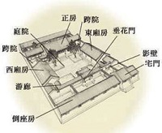
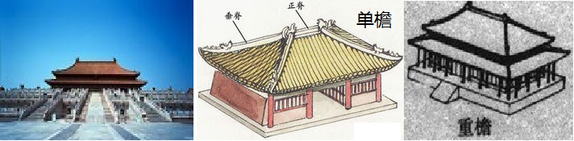
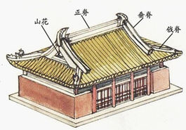
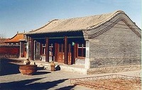
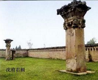

\*\*一些零散的知识\*\*

================= 骑缝章：
魏晋南北朝时期，产生了一系列公文制作制度，其中卷轴制度得以普及并出现了用印制度、骑缝、押缝制度和连署制度。也有人说是汉代就开始了。
副本：西周时就有重要公文必须有副本的规定。

================廊庑wǔ：指“堂下周屋”，即堂下四周的廊屋。分别而言，廊无壁，仅作通道；庑则有壁，可以住人。出自《后汉书》（由南朝宋时期的历史学家范晔编撰的记载东汉历史的纪传体史书。）

===============庑殿顶：庑殿建筑是古代传统建筑中的最高型制，常用于宫殿、坛庙一类皇家建筑，是中轴线上主要建筑最常采取的形式。如故宫午门、太和殿、乾清宫、坤宁宫，太庙大戟门、享殿及其后殿，景山寿皇殿、寿皇门，明长陵棱恩殿等，都是庑殿式建筑。

庑殿顶是“四出水”的五脊四坡式，由一条正脊和四条垂脊（一说戗脊）共五脊组成，因此又称五脊殿。由于屋顶有四面斜坡，故又称四阿顶。

庑殿顶又分为单檐和重檐两种，所谓重檐，就是在上述屋顶之下，四角各加一条短檐，形成第二檐。故宫的太和殿就是重檐庑殿顶，而故宫的英华殿、弘义阁、体仁阁则为单檐庑殿顶。

===============歇山顶：最早见于汉阙石刻，现存最早的是五台山的唐代南禅寺大殿。它晚于庑殿顶，规格上仅此于庑殿顶。如下图，共九条屋脊：1正脊、4垂脊、4戗qiàng脊，因此又称九脊顶。从正脊两端到屋檐处需经过垂脊和戗脊，好比一座大山分成上下两节，坡度变缓，好像“歇”了一歇，故名歇山顶。上半部分为悬山顶或硬山顶样式，下半部分为庑殿顶样式。整体感觉棱角分明、结构清晰。

============卷棚顶（juàn pénɡ
dǐnɡ）：即卷棚式屋顶，又称元宝顶，为双坡屋顶，两坡相交处不作大脊，由瓦垄直接卷过屋面成弧形的曲面，卷棚顶整体外貌与硬山、悬山一样，唯一的区别是没有明显的正脊，屋面前坡与脊部呈弧形滚向后坡，颇具一种曲线所独有的阴柔之美。常用于非正式的皇室离宫，如承德避暑山庄的宫殿。

============阙què：中国古建筑中一种特殊的类型，是最早的地面建筑之一，为帝王宫廷大门外对称的高台，一般有台基、阙身、屋顶三部分，有装饰、缭望等作用。阙的种类按其所在位置有：宫阙、坛庙阙、墓祠阙、城阙、国门阙等，分别立于王宫、大型坛庙、陵墓、城门和古时的国门等处。中文名称：阙英文名称：watchtower
on either side of a palace gate 定义：皇宫门前两边的望楼，或墓道外的石牌坊。

============挟屋：又称殿挟屋，是附于大建筑边的半截小建筑，但不同于抱厦，是与余屋造相对的形式，自元代后不再出现。

==========鸱chī 尾：“鸱”出现在《山海经》中的“西山经”。原文是：有鸟焉，一首而三身，其状如【乐鸟】，其名曰鸱。注：猫头鹰一类的鸟。吻兽是中国古建筑中屋脊兽饰的总称，鸱尾指的是\*\*正脊\*\*两端的这种吻兽。

============经变：经变是指将抽象的佛经文字内容绘制成具体的图画，也称为变相。绘制经变图的目的是希望透过艺术的形式来向信徒宣称佛教的理念，同时也将信众较难理解的教义或翻译文字，转形成容易看懂的图画来呈现。
